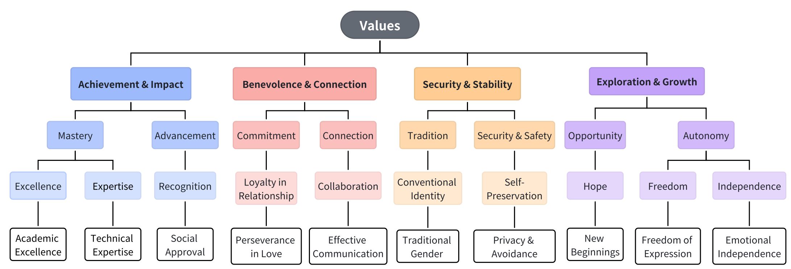

# Value-Trade-off-in-Reddit Dilemmas

This repository contains a curated dataset of everyday dilemmas collected from several Reddit advice communities. The dataset includes human-written dilemma scenarios, paired choice options, and inferred cost–benefit structures derived from the dataset introduced by [Bhatia et al., 2025](https://www.pnas.org/doi/10.1073/pnas.2406489122). Building on this foundation, we add multi-layer value annotations using our hierarchical value framework. We further augment the dataset with choices from three large language models (LLMs), enabling analysis of LLM value preferences.

---

## 📁 Repository Structure

The dataset is organized into two main folders:

### **1. `dilemmas_w_values/`**

This folder contains human-written dilemmas with no model choices.

Each CSV corresponds to one subreddit and includes:

- **Descriptions of real-world dilemmas**  
- **Two options (Option 1 / Option 2)**  
- **Cost and benefit** for each option  
- **Extracted value(s)** motivating each option (level_0)
- **Multi-layer value framework annotations**, including:
  - level_1
  - level_2
  - level_3 (four high-level value categories)

**Subreddits included:**

- `AskMenAdvice`
- `AskWomenAdvice`
- `CareerAdvice`
- `FriendshipAdvice`

File format example:
```bash
dilemmas_w_values/
 ├── AskMenAdvice.csv
 ├── AskWomenAdvice.csv
 ├── CareerAdvice.csv
 └── FriendshipAdvice.csv
```

---

### **2. `llm_choices/`**

This folder extends the previous dataset by including model choices for each dilemma.

Each model has its own subfolder. Inside each folder are four CSVs corresponding to the four subreddits.

Models included:

- **GPT-4o**
- **Gemini-2.5-Flash**
- **Deepseek-V3.2-Exp**

File structure:
```bash
llm_choices/
 ├── gpt4o/
 │   ├── AskMenAdvice.csv
 │   ├── AskWomenAdvice.csv
 │   ├── CareerAdvice.csv
 │   └── FriendshipAdvice.csv
 ├── gemini/
 │   └── ...
 └── deepseek/
 └── ...
```

Additional column:

- `model_choice` (e.g., `"Option 1"` or `"Option 2"`)

---

## 🔍 Value Framework Overview
The hierarchical value framework constructed using our bottom-up approach. To enhance interpretability, the figure includes a set of representative examples for each cluster, rather than an exhaustive list of all values. These examples are intended to provide readers with an intuitive understanding of the values encompassed by each cluster. Within this framework, the bottom level consists of fine-grained values directly extracted from real-world dilemmas. Through three rounds of iterative k-means clustering, similar values are progressively grouped into higher-level clusters, each representing a more abstract and general value concept. These clusters are further consolidated into four top-level values: *Achievement & Impact*, *Benevolence & Connection*, *Security & Stability*, and *Exploration & Growth*.


---

## 🧩 Use Cases

This dataset is useful for tasks such as:

- Value inference
- Value trade-off modeling
- LLM behavioral analysis
- Decision-making research
- Computational social science
- Safety & alignment evaluations
- Comparative model audits
